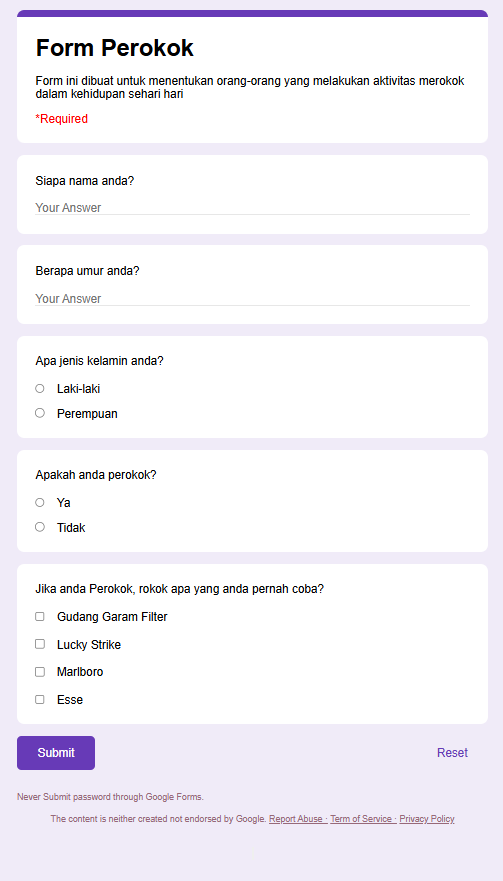

# FORM WITH HTML AND CSS

## GOOGLE FORM
## Hasil

1. Tugas ini adalah tugas meniru styling google form menggunakan html dan css
2. Penerapan css yang digunakan untuk merefactor adalah flexbox
3. Pada form ini menggunakan beberapa type input yakni input text, radio, checkbox, submit dan reset